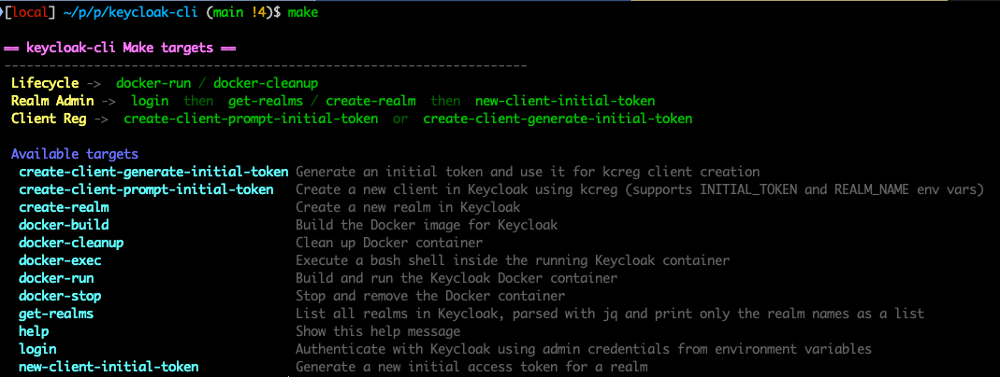

# keycloak-cli

Small helper project to run a Keycloak CLI container and manage realms/clients with `kcadm.sh` and `kcreg.sh` through `make` targets.

Screenshot:



## Prerequisites

- Docker
- GNU Make
- `jq`
- `gum` (for interactive client creation UI)

Install missing CLI tools on macOS:

```bash
brew install jq gum
```

## Project layout

- `Dockerfile`: builds a Keycloak image with preview features enabled
- `Makefile`: entrypoint for build/run/admin/registration commands
- `scripts/kcreg-create-client.sh`: interactive client creation helper

## Configuration

The following variables are used by targets:

- `VERSION` (default: `26.5`)
- `IMAGE` (default: `ghcr.io/bcollard/keycloak-cli`)
- `KC_CONTAINER_NAME` (default: `keycloak-cli`)
- `KC_SERVER_HOSTNAME` (default: `keycloak.kong.runlocal.dev`)
- `KC_ADMIN_PASSWORD` (required for `login`)
- `KC_ADMIN_SECRET_HEADER` (used by admin endpoints)

Example:

```bash
export KC_SERVER_HOSTNAME="keycloak.kong.runlocal.dev"
export KC_ADMIN_PASSWORD="<admin-password>"
export KC_ADMIN_SECRET_HEADER="<secret-header-value>"
```

## Quick start

Build and run container:

```bash
make docker-run
```

Show all commands:

```bash
make help
```

## Key targets

### Docker

```bash
make docker-build
make docker-run
make docker-stop
make docker-cleanup
```

### Keycloak admin (`kcadm`)

```bash
make login
make get-realms
make create-realm
make new-client-initial-token
```

`new-client-initial-token` prints only the raw token (clean output, no JSON quotes).

### Client registration (`kcreg`)

Use one of these flows:

1) Prompt for an existing initial token:

```bash
make create-client-prompt-initial-token
```

2) Generate initial token automatically, then create client:

```bash
make create-client-generate-initial-token
```

## Interactive client creation behavior

The script prompts for:

- Realm (unless provided by env)
- Client ID / name
- Enabled OAuth/OIDC flows (multi-select)
- Redirect URIs (only when Authorization Code Flow is enabled; accepts comma-separated and/or multiline values)
- JWT Authorization Grant IdP (only when JWT grant is enabled)

Then it:

- Builds JSON payload safely with `jq`
- Calls `./kcreg.sh create`
- Prints the full create response
- Prints the client secret if returned

## Advanced usage

Run the script directly with env vars:

```bash
REALM_NAME="myrealm" INITIAL_TOKEN="<token>" KC_CONTAINER_NAME="keycloak-cli" ./scripts/kcreg-create-client.sh
```

If `INITIAL_TOKEN` is set, it is passed as `-t` to `kcreg.sh create`.

The script also uses `KC_SERVER_HOSTNAME` to build the `--server` URL for `kcreg.sh`:

```bash
--server "https://$KC_SERVER_HOSTNAME"
```
